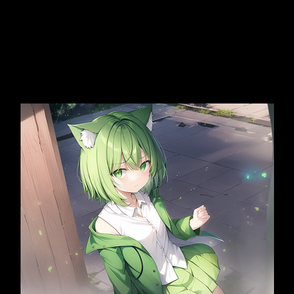
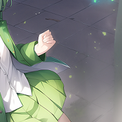

# ffimage [](https://godoc.org/github.com/teacat/ffimage) [](https://coveralls.io/github/teacat/ffimage?branch=master) [](https://travis-ci.org/teacat/ffimage) [](https://goreportcard.com/report/github.com/teacat/ffimage)

The Golang library provides the basic functions for converting and cropping the images with `ffmpeg` command line ([u2takey/ffmpeg-go](https://github.com/u2takey/ffmpeg-go)). An util for me to replace Imagick with ffmpeg for better GIF and AVIF support 😎.

```go
package main

import "github.com/teacat/ffimage"

func main() {
	img, err := ffimage.NewImage("input.png")
	if err != nil {
		panic(err)
	}
	err = img.ResizeImage(300, 300, ffimage.ResizeTypeDownscale).WriteImage("output.png")
	if err != nil {
		panic(err)
	}}
}
```

## Installation

```bash
$ go get -u github.com/teacat/ffimage
```

## Dependencies

#### ffmpeg5

`ffmpeg` is required to be installed. `ffmpeg5` is suggested if you need AVIF support.

```bash
# NOTE: remember to CHECK if the repository is safe!
$ sudo add-apt-repository ppa:savoury1/ffmpeg5
$ sudo add-apt-repository ppa:savoury1/ffmpeg4
$ sudo apt update

# NOTE: This command may remove some apps on your system due to package conflict!
# DO CHECK the terminal output before typing "y" to confirm installation!
$ sudo apt upgrade

$ sudo apt install ffmpeg
```

#### pngquant and gifsicle (Optional)

Applying `SetQuality` to `.gif` and `.png` output requires specified tools since there's no native support for them with `ffmpeg`.

```bash
# pngquant for pngs.
$ sudo apt install -y pngquant

# gifsicle for gifs.
$ sudo apt install -y gifsicle
```

#### exiftool (Optional)

`PreserveEXIF` copys the EXIF from source image to output image and it requires `exiftool`, can be install with the follow command.

```bash
$ sudo apt install -y libimage-exiftool-perl
```

## Available Methods

-   `GetWidth() int`
-   `GetHeight() int`
-   `GetAspectRatio() float64`
-   `ResizeImage(w, h int, typ ...ResizeType)`
-   `ExtentImage(w, h, x, y int, pos ...PositionType)`
-   `CropImage(w, h, x, y int, pos ...PositionType)`
-   `CropThumbnailImage(w, h int)`
-   `ThumbnailImage(w, h int)`
-   `RotateImage(degree int)`
-   `FlipImage()`
-   `FlopImage()`
-   `SetBackgroundColor(color string)`
-   `SetLoop(count int)`
-   `DropFrames()`
-   `GetFrames() int`
-   `SetQuality(quality int)`
-   `SetImageFramerate(fps int)`
-   `SetImageFormat(format ImageFormat)`
-   `WriteImage(path string) error`
-   `PreserveEXIF()`

## Previews

### ResizeImage(w, h int, typ ...ResizeType)

ResizeImage scales the size of an image to the given dimensions. The other parameter will be calculated if 0 is passed as either param. If ResizeType parameter is used both width and height must be given. The image will be stretched to exact size if ResizeType was left unspecified.

-   ResizeTypeUpscale: Given dimensions 400x400 an image of dimensions 300x225 would be scaled up to size 533x400.
-   ResizeTypeDownscale: Given dimensions 400x400 an image of dimensions 300x225 would be scaled up to size 400x300.

|          |               |  |
| :-------------------------------------------: | :---------------------------------------------: | :--------------------------------: |
|            `ResizeImage(300, 300)`            |              `ResizeImage(300, 0)`              |       `ResizeImage(0, 300)`        |
|  |  |                                    |
|       `ResizeImage(300, 300, Upscale)`        |       `ResizeImage(300, 300, Downscale)`        |                                    |

### `ExtentImage(w, h, x, y int, pos ...PositionType)`

ExtentImage comfortability method for setting image size. The method sets the image size and allows setting x,y coordinates where the new area begins. If "pos" is specified, "x" and "y" should be kept as 0.

|     |     |     |
| :-----------------------------------------------: | :------------------------------------------: | :------------------------------------------------: |
|      `ExtentImage(500, 500, 0, 0, TopLeft)`       |      `ExtentImage(500, 500, 0, 0, Top)`      |      `ExtentImage(500, 500, 0, 0, TopRight)`       |
|         |  |         |
|        `ExtentImage(500, 500, 0, 0, Left)`        |    `ExtentImage(500, 500, 0, 0, Center)`     |        `ExtentImage(500, 500, 0, 0, Right)`        |
|  |  |  |
|     `ExtentImage(500, 500, 0, 0, BottomLeft)`     |    `ExtentImage(500, 500, 0, 0, Bottom)`     |     `ExtentImage(500, 500, 0, 0, BottomRight)`     |
|              |                                              |                                                    |
|           `ExtentImage(500, 500, 0, 0)`           |                                              |                                                    |

### CropImage(w, h, x, y int, pos ...PositionType)

CropImage extracts a region of the image. If "pos" is specified, "x" and "y" should be kept as 0.

|     |     |     |
| :---------------------------------------------: | :----------------------------------------: | :----------------------------------------------: |
|         `CropImage(200, 200, TopLeft)`          |         `CropImage(200, 200, Top)`         |         `CropImage(200, 200, TopRight)`          |
|         |  |         |
|           `CropImage(200, 200, Left)`           |       `CropImage(200, 200, Center)`        |           `CropImage(200, 200, Right)`           |
|  |  |  |
|        `CropImage(200, 200, BottomLeft)`        |       `CropImage(200, 200, Bottom)`        |        `CropImage(200, 200, BottomRight)`        |
|              |                                            |                                                  |
|              `CropImage(200, 200)`              |                                            |                                                  |

### CropThumbnailImage(w, h int)

CropThumbnailImage creates a fixed size thumbnail by first scaling the image up or down and cropping a specified area from the center.

|  |
| :-------------------------------------------: |
|        `CropThumbnailImage(300, 300)`         |

### ThumbnailImage(w, h int)

ThumbnailImage creates a fixed size thumbnail and centered the image, the extented area will be filled with background color (black as default, can be set with SetBackgroundColor).

|  |                   |                 |
| :--------------------------------------: | :------------------------------------------------------------: | :-----------------------------------------------------------------: |
|        `ThumbnailImage(300, 300)`        | `.SetBackgroundColor("blue")` <br> `.ThumbnailImage(300, 300)` | `.SetBackgroundColor("#00000000")` <br> `.ThumbnailImage(300, 300)` |

### RotateImage(degree int)

RotateImage rotates an image the specified number of degrees. Empty triangles left over from rotating the image are filled with the background color (black as default, can be set with SetBackgroundColor).

|   |   |  |
| :----------------------------------: | :----------------------------------: | :----------------------------------: |
|          `RotateImage(30)`           |          `RotateImage(90)`           |          `RotateImage(180)`          |
|  |  |                                      |
|          `RotateImage(360)`          |          `RotateImage(720)`          |                                      |

### FlipImage(), FlopImage()

FlopImage creates a horizontal mirror image. FlipImage creates a vertical mirror image.

|  |  |
| :-------------------------: | :-------------------------: |
|        `FlipImage()`        |        `FlopImage()`        |

### SetQuality(quality int)

SetQuality sets the quality for the image from 1 (low quality) to 100 (high quality). Native ffmpeg only works for: AVIF, JPEG, JPEGXL, WEBP.

For output format as PNG, the `pngquant` is required to be installed. The function does nothing for PNG if "pngquant" command was not found.

For output format as GIF, the `gifsicle` is required to be installed. The function does nothing for GIF if "gifsicle" command was not found.

|  |  |  |
| :------------------------------------: | :-----------------------------------: | :-----------------------------------: |
|           `SetQuality(100)`            |           `SetQuality(50)`            |           `SetQuality(10)`            |

### SetImageFramerate(fps int), SetLoop(count int)

SetLoop sets the repeat setting for animated image (e.g. GIF, WebP).

-   "-1" = no loop
-   "0" = infinite
-   "1" = loop once (play 2 times)
-   "2" = loop twice (play 3 times)
-   etc

SetImageFramerate changes the fps of the image, remains unchanged if the target fps is higher than current framerates. Filesize will be reduced if lower framerate was setted.

|  |  |
| :--------------------------: | :---------------------------: |
|    `SetImageFramerate(1)`    |         `SetLoop(1)`          |
